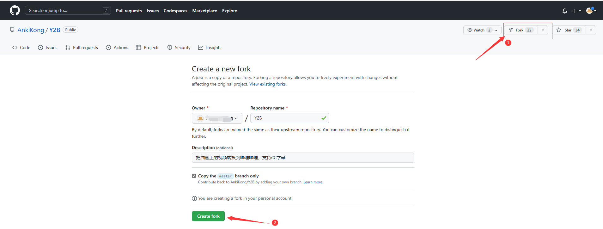
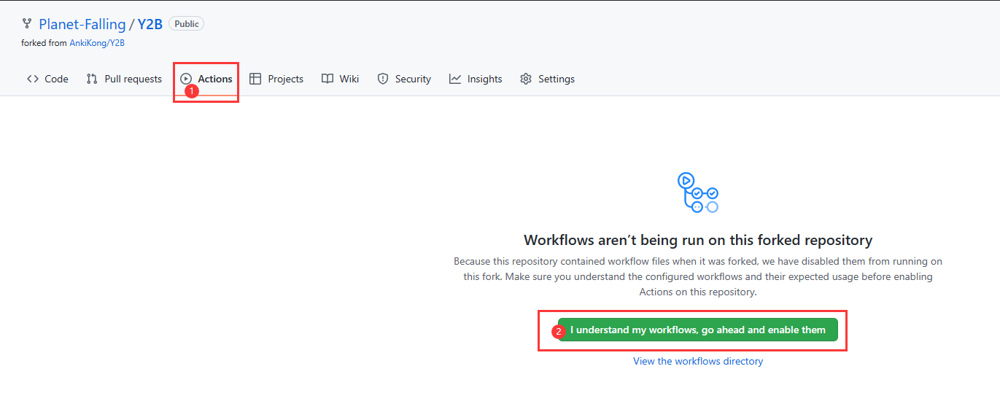
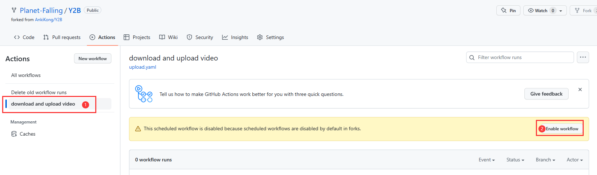
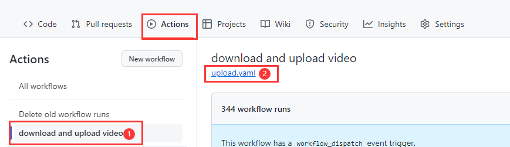

# Y2B

把Youtube上的视频搬运到哔哩哔哩

交流QQ群：**849883545**

## 食用方法

1. 下载 [biliup](https://github.com/ForgQi/biliup-rs/releases)，执行 `biliup login`,登录后会在本地生成一个`cookies.json`。（cookie在发布视频的时候需要用）
2. 打开 [gist](https://gist.github.com/) (如果打不开，你需要 魔法上网)
3. 新建一个文件 `config.json`, 填下面的json, channel_id就是频道的 id, tid是b站的分区id（可以百度查询b站各分区的id [使用说明书--b站分区id表](https://www.bilibili.com/read/cv18327205)），tags是最终投递到b站时，填的标签（有些标签可能不合规，注意查看运行日志判断是否正常），支持配置多个频道。  
接下来就是把第一步生成的 `cookies.json` 内容，在新增一个 `cookie.json` (注意，没有 s ), 把内容赋值粘贴到里面。  
(ytb 获取channel_id的方法：打开ytb用户个人页，f12开启开发者工具，运行命令 `ytInitialData.metadata.channelMetadataRenderer.externalId`获取)

   ``` json
   [
    {
        "channel_id": "UCYSAWDQnoz0uIBRYlophvNw",
        "tid": 232,
        "tags": "youtube,搬运,翻新"
    }
   ]
   ```

4. 完成后效果大概这样子 ，然后保存为 `Create secret gist`，**一定要是 secret 的，不然你的密钥会泄露** 。保存后会跳转到新页面，把 gist id 复制下来，就是划红线的东西 
5. [申请一个 GitHub token](https://github.com/settings/tokens/new),时间选永久，scope勾上gist，然后点击生成,把token复制下来   
6. fork 本仓库 
7. 按顺序点进去  
8. 配置2个配置项 NAME分别配置`GIT_TOKEN`和`GIST_ID`。把前面的 gist id 和 token 填进去  
9. 手动触发一下 action ，看看有没有问题   

## 手动跳过部分视频
运行时可能会碰到会员视频、直播、404视频等，可以手动修改 gist的uploaded_video.json，配置视频id进去，就可以跳过了。重复标题视频第二次运行会自动跳过。

## action执行间隔

修改`Y2B/.github/workflows/upload.yaml`文件中，第5行左右，其中的cron配置，鼠标悬停可以看到当前配置的执行情况
```
schedule:
    - cron: "*/30 * * * *"
```

